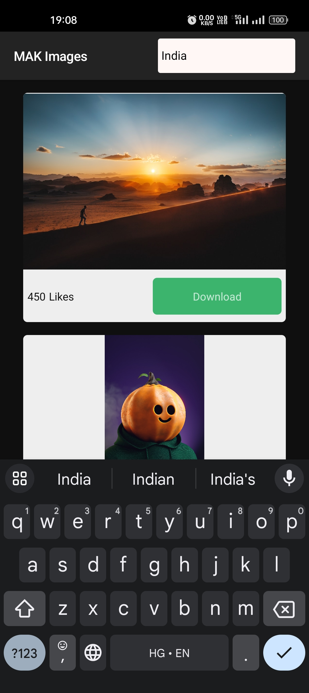

<div align="center">
  
  <h1>MakLens</h1>
</div>


## Introduction

Welcome to the HD Image Search and Download App! This native mobile application is designed to help you discover and download high-definition images right to your mobile device.
## Features

- **High-Quality Image Search:** Effortlessly search for images in HD quality to find the perfect visuals for your projects or personal use.

- **Download Images:** Once you find the image you like, download it directly to your mobile device for offline access.

- **Intuitive User Interface:** Our user-friendly interface makes it easy for users of all levels to navigate and find the images they desire.

- **Fast and Efficient:** Get results quickly, ensuring that you can find the right images without wasting time.

- **Save to Gallery:** Images can be saved to your device's gallery, making it easy to access and share them.


## How to Use

1. **Search:** Enter your search query to find images related to your interests.

2. **Browse:** Scroll through the search results to find the image you like and navigate to next and previous pages.

3. **Download:** Hit the download button present in below a particular image to save it to your device.

4. **Gallery:** Access all your downloaded images in the app's gallery for easy management.


## API Reference

#### Get Feed Items

```http
  GET /photos
```

| Parameter | Type     | Description                |
| :-------- | :------- | :------------------------- |
| `api_key` | `string` | **Required**. Your Unsplash API key |
| `page`    | `string` | **Optional**. Page number to retrieve.(Default 1) |
| `per_page`| `string` | **Optional**.  Number of items per page. (default: 10)|

#### Get Items by Search

```http
  GET /search/photos
```

| Parameter | Type     | Description                       |
| :-------- | :------- | :-------------------------------- |
| `api_key` | `string` | **Required**. Your Unsplash API key |
| `query`   | `string` | **Required**. 	Search terms. |
| `page`    | `string` | **Optional**. 	Page number to retrieve. (default: 1) |
| `per_page`| `string` | **Optional**.  Number of items per page. (default: 10)|


#### Example

Link: https://api.unsplash.com/photos?page=1&client_id=${your api_key}

Link: https://api.unsplash.com/search/photos?page=1&query=India&client_id=${your api_key}


## Environment Variables

To run this project, you will need to add the following environment variables to your .env file

`REACT_APP_UNSPLASH_API_KEY = {your api key}`


## Installation

Ensure that your [React Native development environment](https://reactnative.dev/docs/environment-setup) is properly configured.

Clone the Repo and install MakLens with npm


```bash
  npm install
```
Run the below command in order to bundle the application and run on physical or virtual device:
```bash
  npm run android
```
## Screenshots





